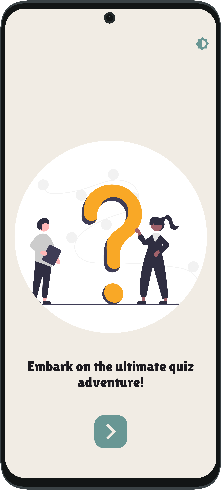
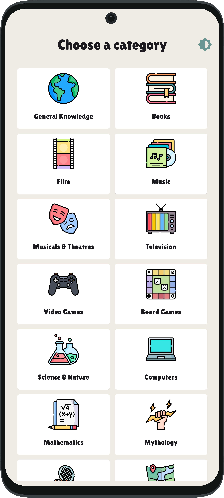
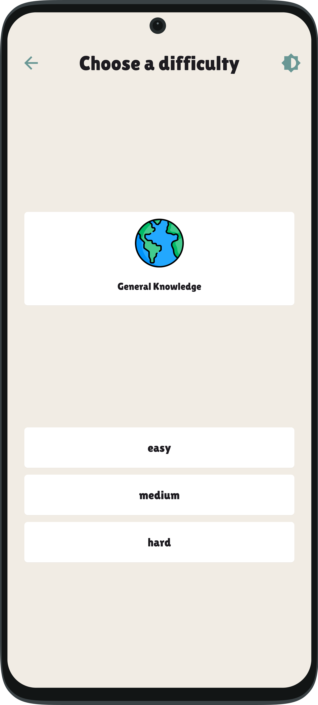
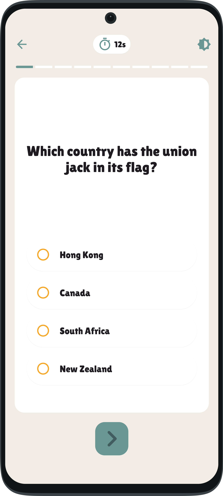
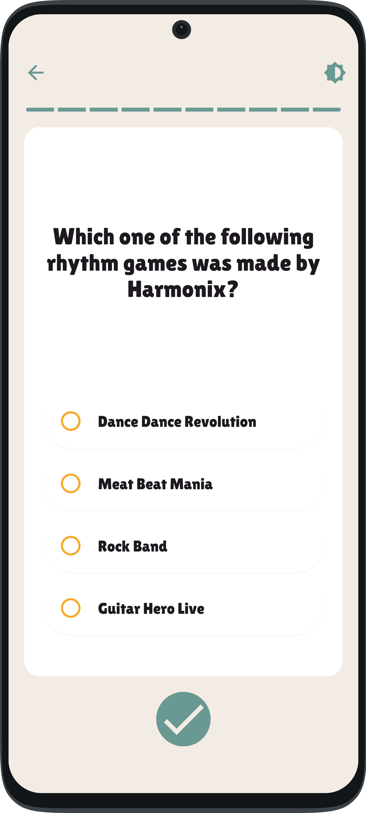
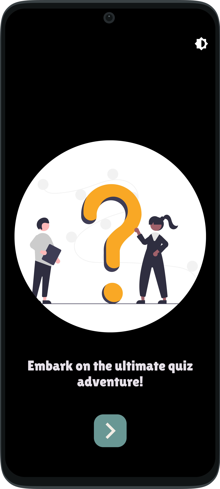
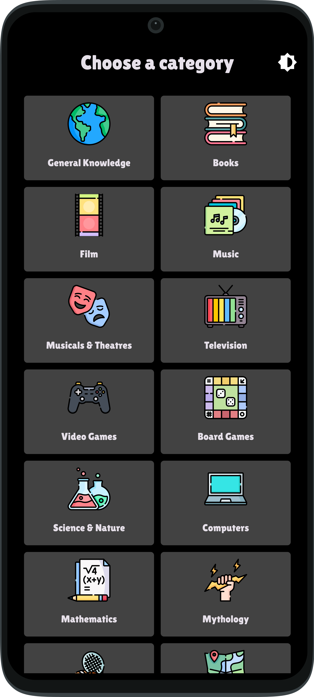
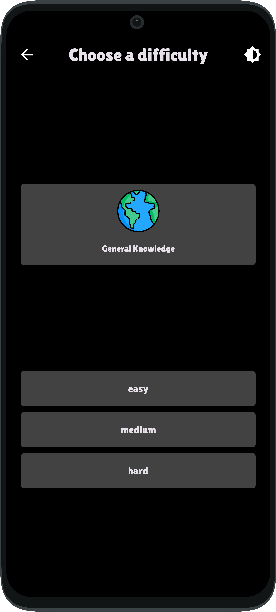
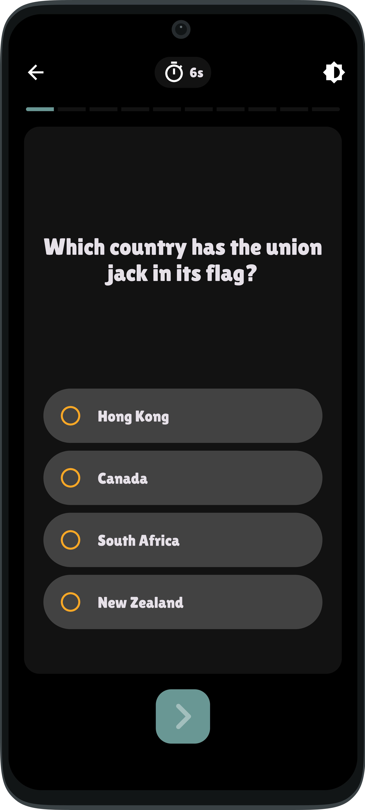
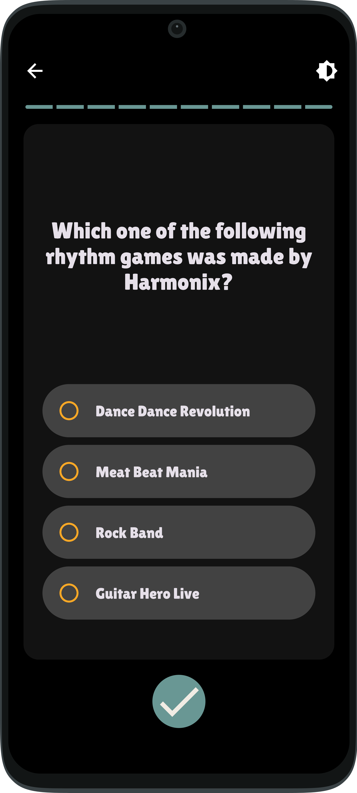

# Trivico

A modern, production-grade trivia application built with Flutter, following Domain-Driven Design principles and utilizing advanced state management with Riverpod.

## Features

- **Rich Quiz Experience**
  - Dynamic trivia questions from Open Trivia Database API
  - Multiple choice questions with interactive UI
  - Real-time score tracking
  - Quiz history and statistics
  - Beautiful animations and transitions

- **Modern Architecture**
  - Domain-Driven Design (DDD) architecture
  - State management with Riverpod
  - Immutable state with Freezed
  - Type-safe routing with GoRouter

- **Production Features**
  - Offline support
  - Error handling and crash reporting
  - Analytics integration
  - Theme support (Light/Dark)
  - Responsive design
  - Performance optimized

## Screenshots

### Light Theme

| Screenshot 1 | Screenshot 2 | Screenshot 3 |
| ------------ | ------------ | ------------ |
|  |  |  |

| Screenshot 4 | Screenshot 5 | Screenshot 6 |
| ------------ | ------------ | ------------ |
|  |  |  |

### Dark Theme

| Screenshot 1 | Screenshot 2 | Screenshot 3 |
| ------------ | ------------ | ------------ |
|  |  |  |

| Screenshot 4 | Screenshot 5 | Screenshot 6 |
| ------------ | ------------ | ------------ |
|  |  |  |

## Getting Started

### Prerequisites
- Flutter SDK (>=3.22.2)
- Dart SDK (>=3.4.3)
- Android Studio / VS Code
- Git

### Installation

1. Clone the repository:
```bash
git clone https://github.com/yourusername/trivico.git
cd trivico
```

2. Install dependencies:
```bash
flutter pub get
```

3. Create a `.env` file in the root directory with required configuration:
```
API_BASE_URL=your_api_url
```

4. Generate necessary files:
```bash
flutter pub run build_runner build --delete-conflicting-outputs
```

5. Run the app:
```bash
flutter run
```

## Architecture

The project follows Clean Architecture principles with DDD:

```
lib/
├── core/
│   ├── application/    # Use cases and state management
│   ├── domain/         # Business logic and entities
│   ├── infrastructure/ # External services implementation
│   └── presentation/   # UI components
├── shared/
│   ├── constants/      # App-wide constants
│   └── utils/          # Utility functions
└── main.dart           # Entry point
```

### Key Components

- **State Management**: Riverpod with code generation
- **API Integration**: Dio with retry mechanism
- **Navigation**: GoRouter for declarative routing
- **Analytics**: Firebase Analytics
- **Error Tracking**: Firebase Crashlytics

## Testing

Run tests using:
```bash
flutter test
```

### Test Coverage
```bash
flutter test --coverage
genhtml coverage/lcov.info -o coverage/html
```

## Building for Production

### Android
```bash
flutter build appbundle --release
```

### iOS
```bash
flutter build ips --release
```

## Configuration

The app uses different configuration files:
- `.env` - Environment variables
- `pubspec.yaml` - Dependencies and assets
- `analysis_options.yaml` - Linting rules

## Contributing

1. Fork the repository
2. Create your feature branch (`git checkout -b feature/amazing-feature`)
3. Commit your changes (`git commit -m 'Add amazing feature'`)
4. Push to the branch (`git push origin feature/amazing-feature`)
5. Open a Pull Request

### Code Style
- Follow the official [Flutter style guide](https://dart.dev/guides/language/effective-dart/style)
- Use the provided analysis options
- Run `flutter analyze` before committing

## License

This project is licensed under the MIT License - see the [LICENSE](LICENSE) file for details.

## Analytics and Monitoring

The app includes:
- Firebase Analytics for user behavior tracking
- Firebase Crashlytics for crash reporting
- Custom event tracking for key user actions

## Security

- API keys stored securely in .env file
- Network security with HTTPS
- Input validation
- Secure storage for sensitive data

## Supported Platforms

- Android (API 21+)
- iOS (13.0+)
- Web (Progressive Web App)

## Version History

See [CHANGELOG.md](CHANGELOG.md) for all changes.

## Support

For support, email support@yourdomain.com or open an issue in the repository.
